*********************************
Setup of Bluecherry client
*********************************

Client installation

======================================

Installation
------------

Connecting to a server
----------------------

The next three steps will allow you to easily connect to an existing Bluecherry installation.

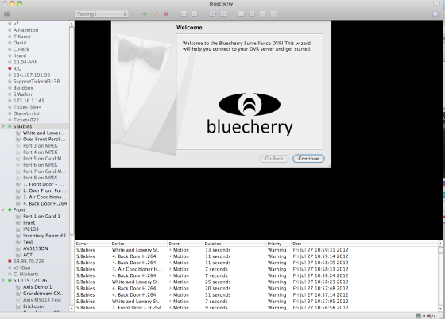

Enter the hostname or IP address of the Bluecherry server. The default login and password for new installations is 'Admin' and 'bluecherry' (no quotes). You can optionally click 'Use default' to have this information automatically entered for you.

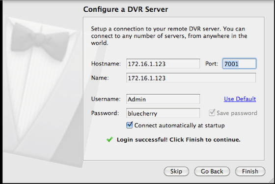

Finish by clicking 'close'

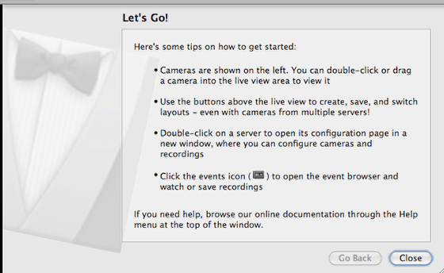

Adding your first server
------------------------

The Bluecherry client can connect to multiple Bluecherry servers.  

Inside the client click 'Add new server'

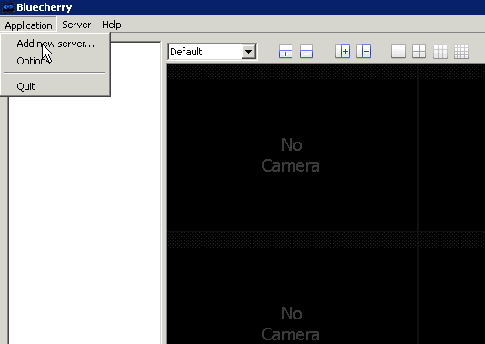

Enter your the name of the DVR, the hostname, and the login / password information for the Bluecherry version 2 system you are connecting to. The default port is 7001. You can add as many servers as you prefer to the client.

The default login for a new server is 'Admin' and 'bluecherry'.

If you are connecting remotely to a server behind a firewall or NAT make sure ports 7001 and 7002 are open.

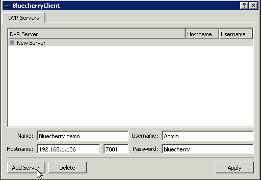

Once you select 'Apply' the client will automatically connect to the server. All cameras that are enabled and that you have access to will populate on the left side. All events will populate on the bottom part of the screen.

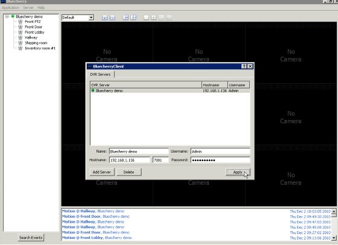

Adding cameras to the live view
-------------------------------

Once you have successfully connected to a Bluecherry server the list of available cameras will be displayed on the left.

.. image:: img/media_1343401663259_display.png

Drag and drop cameras onto the live view area

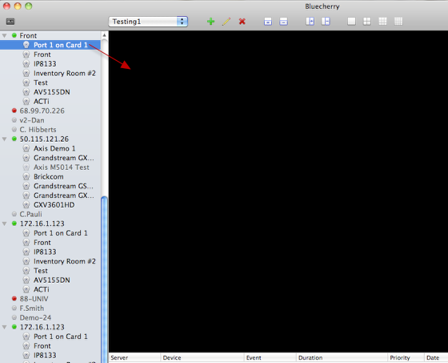

Select any camera from the left and drag it into the layout.

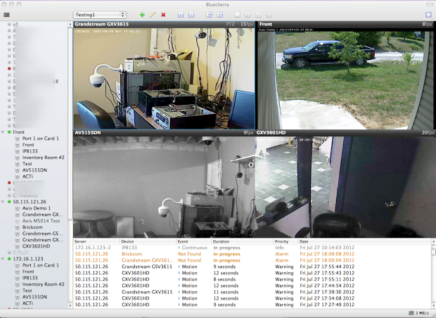

You can repeat this process or any camera or DVR that you have listed on the left side. Note: It's possible to connect as many clients together as you need, and mix and match the videos in different layouts.

**Audio**

Cameras with audio stream available are marked with the blue speaker icon. You can turn on audio by selecting "Enable audio" in the right-click menu of the selected camera.

.. image:: img/57cc3c5a903360649f6e5018/file-fvdWbUe8AD.png

When audio is enabled on one camera, it is disabled on all others, only the single camera stream can be listened at the same time.

If your camera supports audio, but the speaker icon does not appear in the live view area, please check that "Enable audio" checkbox is checked in camera properties of the Bluecherry server administration interface and  audio stream is enabled in camera's own settings.

Layouts
-------

We support several different methods of viewing your cameras. First, it's possible to create as many layouts as you need. For example, you are a school resource officer who wants to only watch the hallways of your school that has two Bluecherry DVR systems installed. You can create a new layout

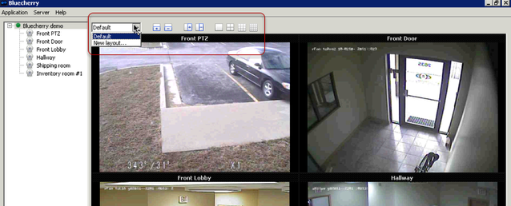

First, it's possible to create as many layouts as you need. For example, you are a school resource officer who wants to only watch the hallways of your school that has two Bluecherry DVR systems installed.

First drag and drop the cameras into the layout that you prefer. Then click 'New Layout' and create a name for the new layout and click ok.

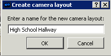

**Pre-defined layouts**

We provide four pre-defined layouts as seen in the box above. These are one channel, four channel, nine channel and sixteen channel layouts.

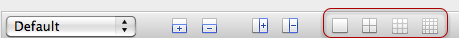

**Create your own layout with rows and columns**

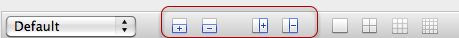

Using Pan / Tilt / Zoom enabled cameras
---------------------------------------

A screen cast has been setup overviewing how to use the Pan / Tilt / Zoom options in Version 2.

.. youtube:: -4YeH3UCUCA

Viewing previously recorded events
----------------------------------

By default all events from all connected servers will display in this list. Cameras that are enabled but can not be accessed (camera offline, etc) will be highlighted in orange and in the Event column it will be listed as 'Not Found'

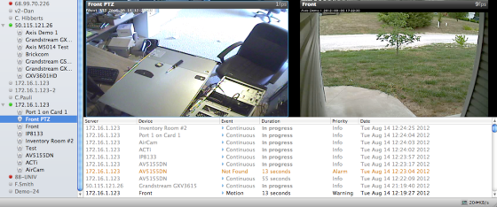

Hovering over an event will show detailed information about that event

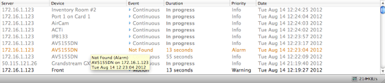

Double clicking on the event will pull up the video. At this point you can play and fast forward / rewind the event.

.. image:: https://s3.amazonaws.com/screensteps_live/step_images/bluecherry/22903/media_1344965435831_display.png

Searching events
----------------

By default the list of events under the main live view window are limited to just a few hours.  To access all of the events select 'Events' in the top left corner of the UI.

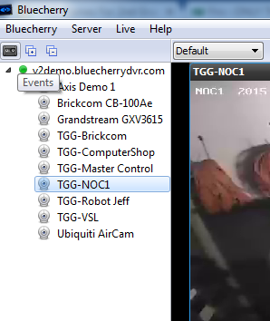

From the screen below you can select the camera(s) you want to view events on, along with the date.  You can also filter by event types (motion, continuous, alarm, etc)

.. image:: img/file-IVwulSqFHd.png

Once you select the date click **Load events**, this is a very important step, otherwise the server will not display any events.

