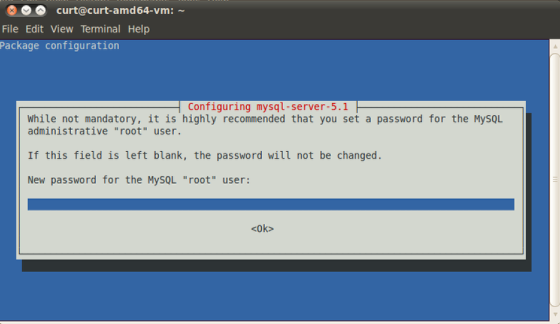
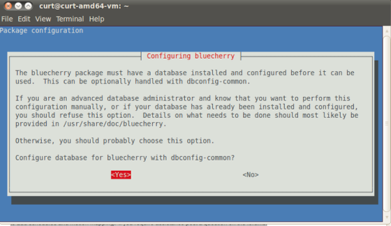
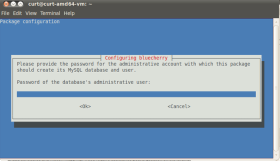
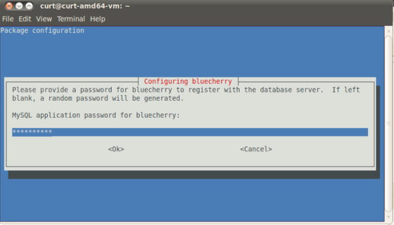
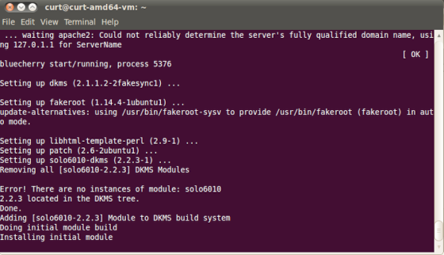

*********************************
Installation of Bluecherry server
*********************************

Server Installation

======================================

Requirements
------------

Version 2 supports Ubuntu LTS releases (Ubuntu 14.04 and Ubuntu 16.04), Debian Jessie and experimental support for CentOS 7.

Ubuntu has two different x86 installation methods. The first is Ubuntu desktop, which will install Ubuntu along with the graphical interface. It is recommended that users without prior knowledge of Ubuntu or Linux use this method. You can also download our ISO image (bluecherry-v2-desktop-14.04-amd64.iso)

The second installation method is Ubuntu Server. The installation is a text-based interface and significantly more complicated then the desktop method. By default, the installation will not include the graphical desktop, which some users prefer. It is recommended for customers with prior experience adding third party software repositories from a command line.

Installing Bluecherry from the Bluecherry repository
----------------------------------------------------
Obtain download instructions

If you haven’t purchased a software license from us, you can give our software a free 30 day spin by clicking here and you will be given the download instructions.

Copy and paste the commands to add our repository, or use the ISO to automate the install.

``sudo bash -c "$(wget -O - https://dl.bluecherrydvr.com/scripts/install)")"``

Installing the server
---------------------

The instructions below assume you have received the download instructions, or installed from our CD installer.

If you do not already have mysql-server installed you will be prompted to create a password for the ‘root’ MySQL account. While Ubuntu lists this as optional, it is recommended that you set a password.

.. image:: img/term-bluecherry-2.png

You will now be asked to configure Bluecherry. You must hit Yes, or the installation process will fail.

Enter the database administrative password that you set previously for the ‘root’ user.

Enter the password that you want to create for the bluecherry database. This can be the same password that you provided for the root MySQL account, but we recommend keeping the password unique. You will be asked to enter this password twice to verify the password matched.

At this point the bluecherry server will be installed. If you plan to install the client on the same system, then please follow the client installation guide.
