Setup and configuration
=======================

Logging in
----------

**Connect to the server with a web browser**

By default the server runs on a port 7001, and requires SSL. You can access the server using https://hostname:7001

Navigating the web interface
---------------------------

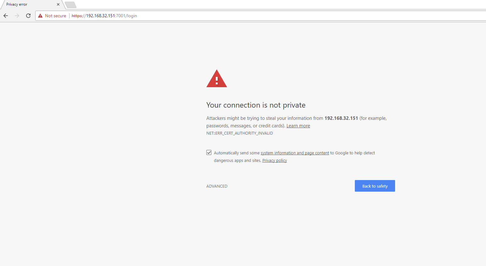

1. Live View - Web based live view streaming
2. Playback  - Watch recorded media
3. Download remote client - Links to www.bluecherrydvr.com/download for downloading the cross platform client
4. Documentation - Link to online documentation
5. Announcements - Recent updates and information
6. General settings - Change settings such as the name and location of the DVR, and outgoing SMTP email notifications
7. Storage - Easily add and manage storage
8. Users - Add and manage who has access to live view, recordings and individual cameras
9. Connected users - See who is currently connected to your system
10. Devices - Add and manage analog and IP cameras (Note: A Bluecherry hardware compression card is required for analog card support)
11. Global schedule - Easily select which days and hours your system will record. Choose between motion detection, continuous recording and no recording
12. Email notifications - Easily add email notifications rules based on time of day and selected cameras
13. Event statistics - Get statistics about the the camera recording schedule
14. Database backup - Create or restore a database backup
15. System Log - Easily view Bluecherry logs (both web and Bluecherry logs)
16. License Keys - Easily add license keys to expand your Bluecherry system
17. Server statistics - This section shows current CPU, memory and how long the system has been running.
18. Profile link - Here you can easily update your profile, reset your password, or simply logout

Recording schedules
------------------

We support two types of schedules. The first is a global schedule and the second is a per-camera schedule. Both are covered below

.. image:: docs/global-schedule.png

**Global schedule**

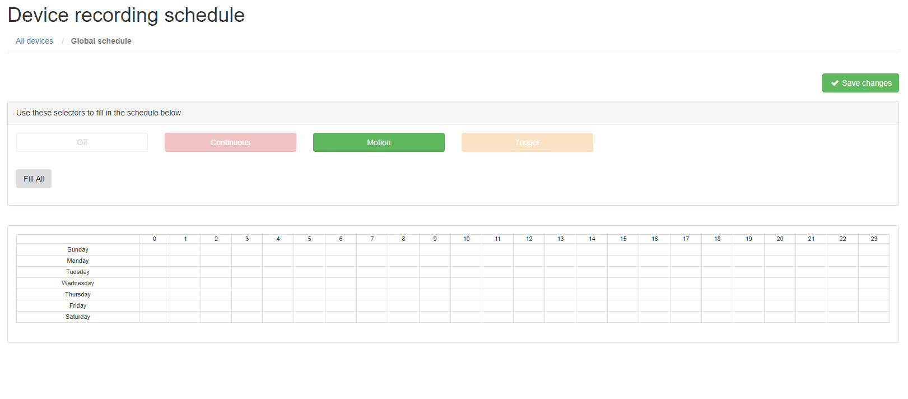

**Select ‘Motion’ and then select all the grid locations (Assuming that you want motion detection 24×7×7).**

Per-camera schedule
-------------------

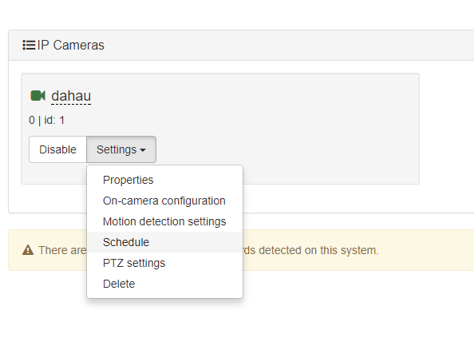

Under the Devices tab, select ‘Schedule’ under each camera that you want to enable a camera specific scheduled recording.

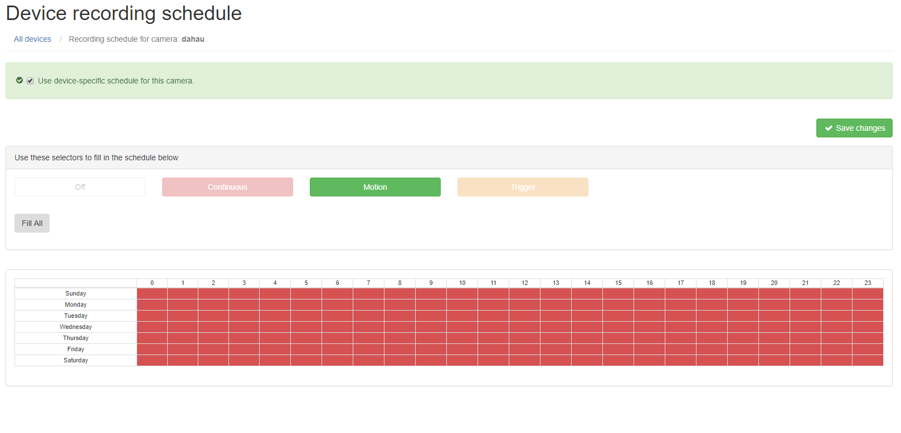

**Select the checkbox for ‘Use device-specific schedule for this camera’ and select the type of recording schedule you want and click ‘Save changes’**

Adding users
------------

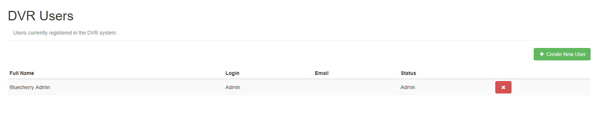

**Select ‘Create New User’ to add a new user to the DVR system**

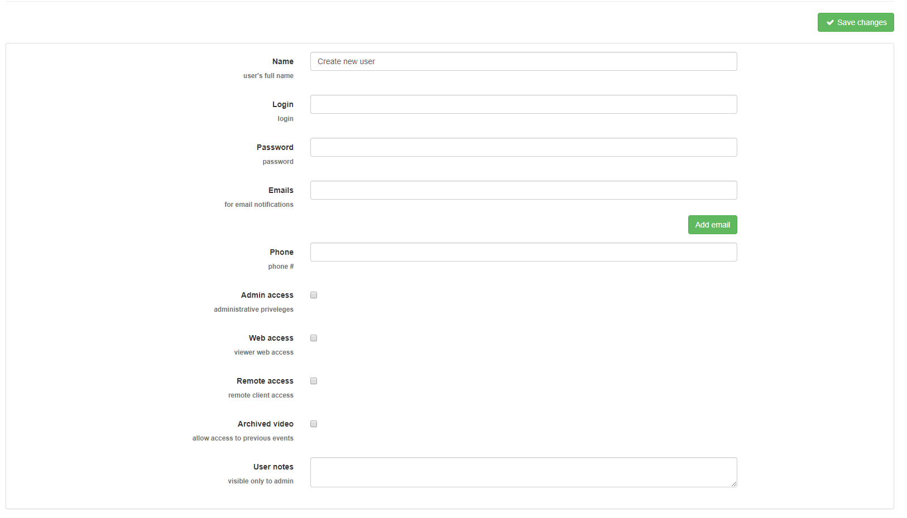

**Complete the form with the user specific information. It’s usually recommended to have two administrator accounts, in case one user is delete or the password is forgotten.**

Editing / viewing users
----------------------

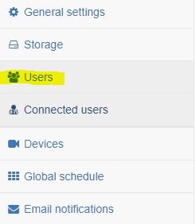

**Click on user's Full Name. Note: To prevent you from accidently removing yourself it is not possible for you to remove the account you are logged in as.**

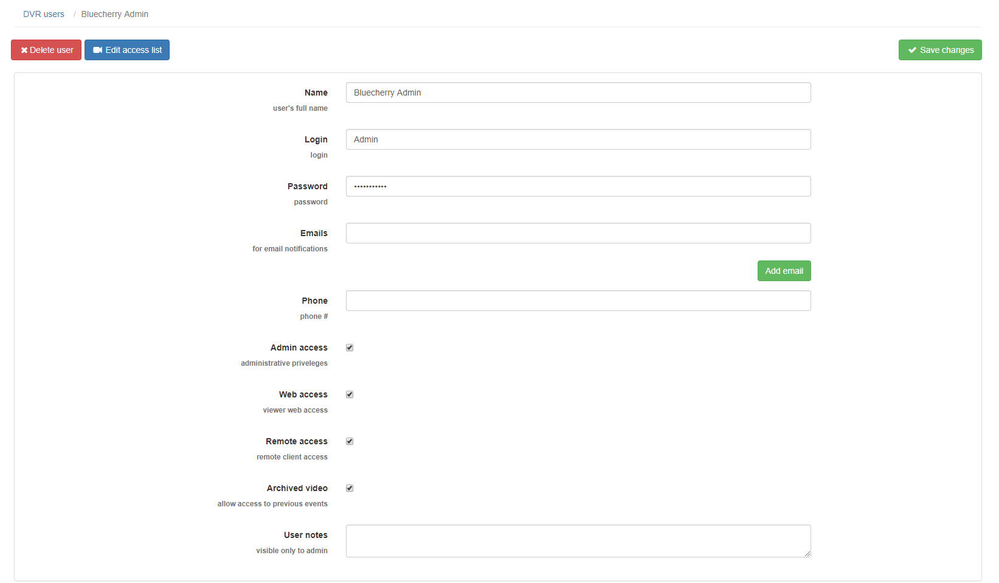

**You can the option to change any of the fields above, including the password. You can also add specific restrictions on what the user has access to. The notes section lets you add user specific notes.**

Restrict cameras per user
-------------------------

**Restricting access on a per-user basis**

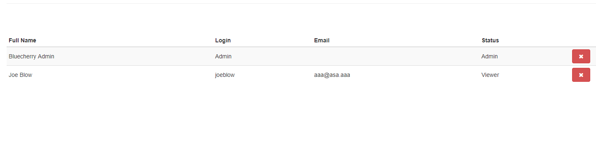

From the ‘Users’ section click on any of the names in the list. For this example, we are going to pick on Joe Blow, who we do not trust.

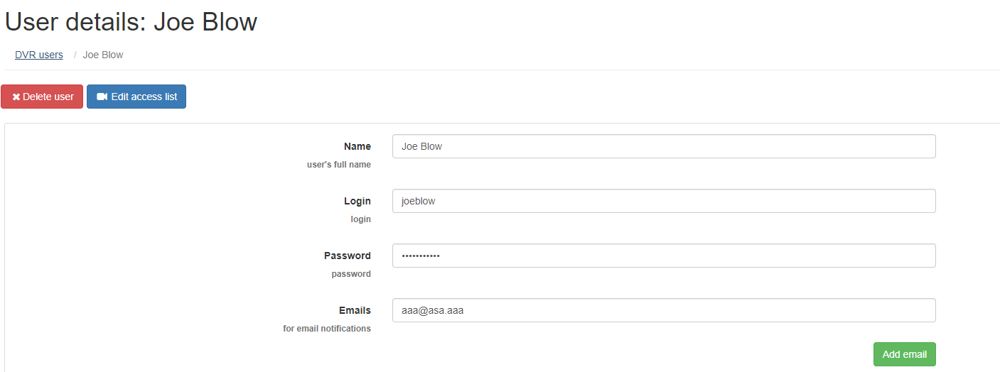

**Click ‘Edit access list’**

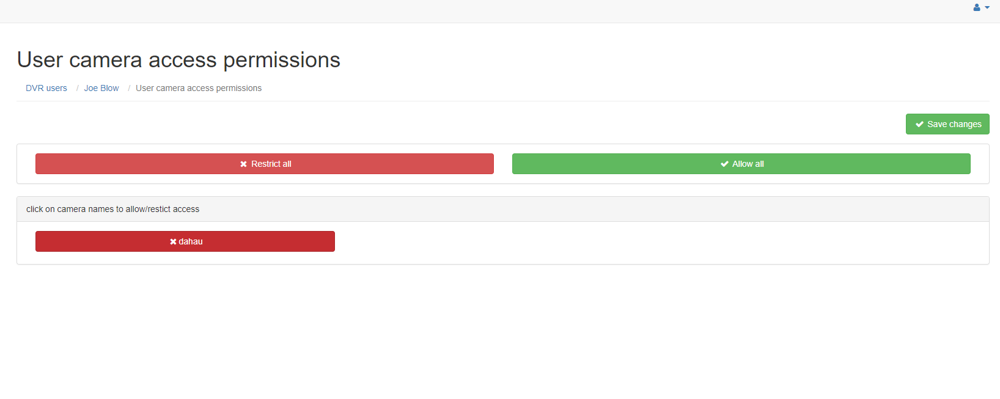

**By default Joe Blow has access to all cameras. We do not want him to have access to cameras, simply click on the camera name. This will change the color of the camera from green (full access) to red (no access). Joe Blow will not see the camera in the available video devices, or in the event / search area. Changes are applied instantly.
**

System logs
-----------

**Select ‘System Log’ from the left menu bar **
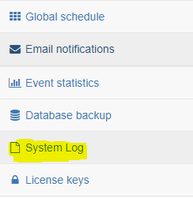

**This log shows everything that has been logged to /var/log/bluecherry.log and to /var/lib/bluecherry/www-error.log
Note: These logs is randomly rotated, so it will likely not contain all of the logs since the server has started.**

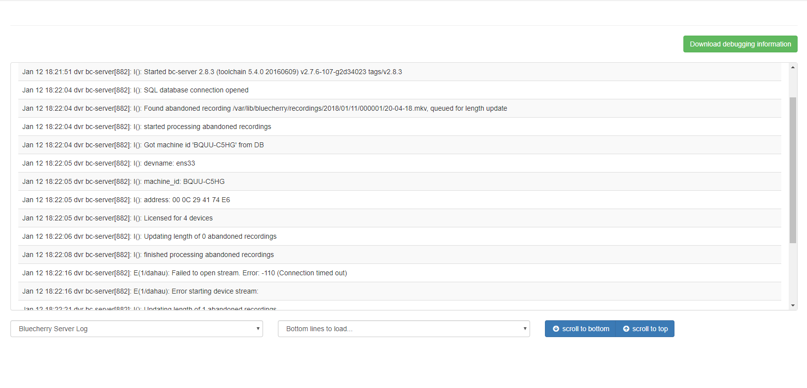

Admin password reset procedure
------------------------------

In case you’ve lost or forgot Bluecherry server Admin password, you can change it to default in database.

``mysql -u bluecherry -p bluecherry -e "update Users set password='b22dec1d6cfa580962f3a3796a5dc6b3', salt='1234' where username='Admin';"``

This resets the login to Admin and the password to bluecherry
